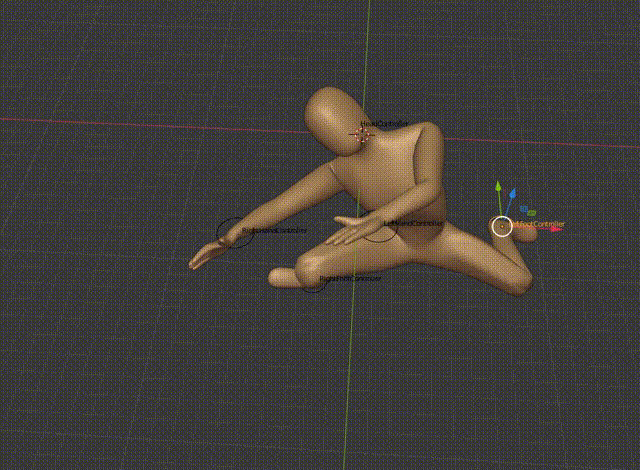
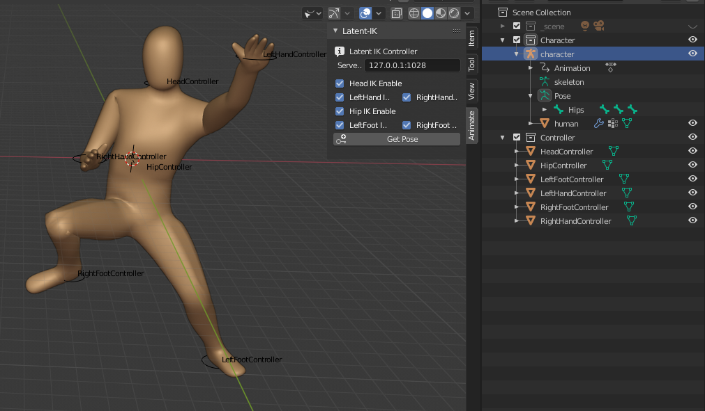

# Latent Pose

A data-driven IK demo in Blender  
Pose sampled from a VAE(Vposer) trained with CMU mocap data.

My blog on this: [Data-Driven IK In Character| 角色中的数据驱动反向动力学](http://ma-yidong.com/2020/05/24/data-driven-ik-in-character/)

# Requirement

- Blender 2.8+
- python 3.6
  - pytorch 1.4.0
  - numpy 1.18
  - flask 1.1.2
  - tqdm 4.43

# How to use

1. Start server, run `python server.py`

2. install blender plugin  
in Blender-Edit-Preference-Addons-Install, select `latent-ik/latent-ik.py` to install it.  
after installment, enable Latent-IK plugin

3. Open latent-ik.blend  
Next you can move controllers, use short-cut `Ctrl+P` to update pose  
Also you can select the Armature and enable or disable some controller  

# How it works  

A trained VPoser on CMU mocap data

# How to train your own vposer

1. download some bvh data into `data/raw` folder.
2. open `data/raw/extract_skeleton.blend`, import any bvh, run script `data/raw/extract_skeleont.py` to extract skeleton definition  
3. run `python -m data.extract_bvh_animation` to extract bvh animation to joint's matrix into `data/extracted`  
4. run `python -m data.prepate_training` to convert bvh animation to axis-angle form for training.  

# Reference

- VPoser  
https://github.com/nghorbani/human_body_prior 
- SMPL-torch  
https://github.com/CalciferZh/SMPL 
